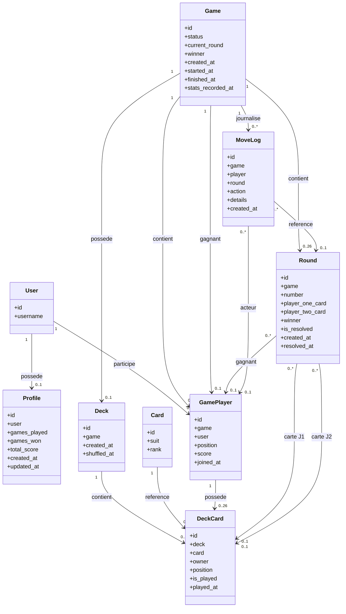
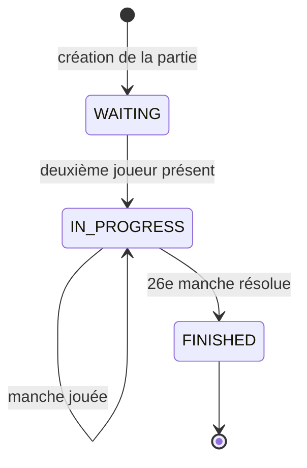
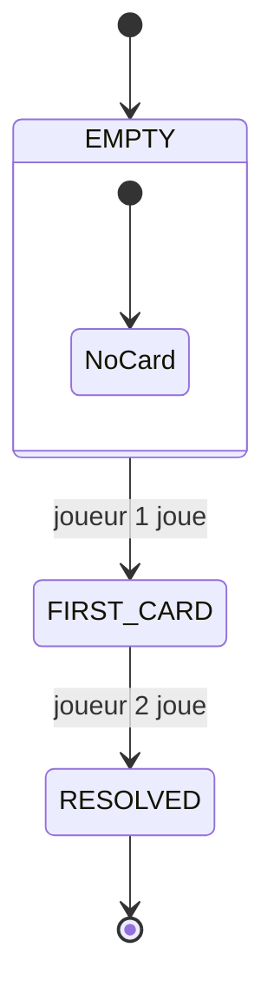

# Bataille simplifiée - Jeu de cartes Django

## Membres du groupe

- Dina CHAOUKI
- Cécile Audrée DEMEUNI
- Aurélie DEMURE

## Présentation du projet

Ce projet est une application web permettant à deux utilisateurs de jouer à une version simplifiée de la Bataille.

L’application est développée avec Django et utilise PostgreSQL pour la persistance des données. Elle peut être lancée entièrement avec Docker Compose.

### Règles du jeu

La partie se déroule entre deux joueurs avec un paquet standard de 52 cartes.

1. Les 52 cartes sont mélangées.
2. Chaque joueur reçoit 26 cartes.
3. À chaque manche, les deux joueurs retournent automatiquement la prochaine carte de leur paquet.
4. La carte ayant la valeur la plus élevée remporte la manche.
5. Le gagnant de la manche obtient un point.
6. En cas de cartes de même valeur, aucun joueur ne marque de point.
7. La partie se termine après 26 manches.
8. Le joueur ayant le score le plus élevé remporte la partie.
9. En cas d’égalité des scores, la partie ne possède pas de gagnant.

Les valeurs des cartes sont comprises entre `2` et `14` :

- `11` : Valet ;
- `12` : Dame ;
- `13` : Roi ;
- `14` : As.

### Capture d’écran de l’interface principale

## Guide de démarrage rapide

### Prérequis

Pour lancer le projet, il faut installer :

- Docker ;
- Docker Compose ;
- Git.

Aucune installation locale de Python ou de PostgreSQL n’est nécessaire lorsque l’application est lancée avec Docker.

### Installation

Cloner le dépôt :

```bash
git clone https://github.com/lilipix/card-game-django/
cd card-game-django
```

### Workflow Git recommandé

Pour éviter les conflits sur la branche principale, le flux conseillé est :

```bash
git switch main
git pull origin main
git switch -c feature/ma-fonctionnalite
```

Pendant le développement :

```bash
git add .
git commit -m "feat: description courte du changement"
git push -u origin feature/ma-fonctionnalite
```

Ensuite, ouvrir une Pull Request vers `main` plutôt que pousser directement sur `main`.

### Configuration des variables d’environnement

Créer le fichier d’environnement à partir de l’exemple :

```bash
cp .env.example .env
```

Vérifier et, si nécessaire, compléter les variables du fichier .env.

### Lancement de l'infrastructure

Construire et lancer l'ensemble des services :

```bash
docker compose up --build
```

L'application est ensuite disponible à l'adresse :

```bash
http://localhost:8000
```

Pour éxécuter les conteneurs en arrière-plan :

```bash
docker compose up --build -d
```

### Création d’un compte administrateur

Dans un autre terminal, exécuter :

```bash
docker compose exec web python manage.py createsuperuser
```

Renseigner ensuite :

le nom d’utilisateur ;
l’adresse e-mail, si elle est demandée ;
le mot de passe.

L’interface d’administration est accessible à l’adresse :

```bash
http://localhost:8000/admin/
```

### Exécution des migrations

Les migrations peuvent être exécutées manuellement avec :

```bash
docker compose exec web python manage.py migrate
```

### Exécution des tests

```bash
docker compose exec web python manage.py test
```

### Arrêt de l’application

```bash
docker compose down
```

## Architecture logicielle

Le projet suit l’architecture MVT de Django :

- Model : représente les parties, les joueurs, les cartes et les manches ;
- View : reçoit les requêtes et appelle le moteur de jeu ;
- Template : affiche les données dans l’interface ;
- Game engine : applique les règles métier indépendamment de l’affichage.

Le moteur de jeu est isolé dans game_engine.py. Les vues ne décident pas directement du gagnant d’une manche et ne modifient pas librement les scores. Elles transmettent les actions au moteur, qui contrôle les règles avant toute écriture en base de données.

Cette séparation permet notamment :

- de limiter les responsabilités des vues ;
- de centraliser les règles du jeu ;
- de faciliter les tests ;
- d’empêcher un utilisateur de tricher en modifiant une requête côté client.

### Diagramme de classe ORM



#### Rôle des principaux modèles

- Game : représente une partie et conserve son état, la manche actuelle et son éventuel gagnant.
- GamePlayer : associe un utilisateur à une partie et stocke sa position et son score.
- Profile : conserve les statistiques générales d’un utilisateur.
- Card : définit une carte de référence par son enseigne et sa valeur.
- Deck : représente le paquet associé à une partie.
- DeckCard : représente une carte distribuée dans une partie, avec son propriétaire, sa position et son état.
- Round : enregistre les deux cartes jouées et le résultat d’une manche.
- MoveLog : conserve l’historique des actions importantes.

#### Répartition des responsabilités

Les contraintes des modèles garantissent notamment l’unicité des positions des joueurs, des cartes dans un paquet et des numéros de manche. Les règles impliquant plusieurs modèles sont contrôlées par game_engine.py, comme la présence de deux joueurs avant le démarrage, la distribution de 26 cartes par joueur, l’interdiction de rejouer une carte et l’arrêt de la partie après 26 manches.

### Machine à états de la partie



#### Description des états et des transitions

Une partie est créée dans l’état WAITING. Elle passe à IN_PROGRESS lorsque le deuxième joueur rejoint la partie et que les cartes sont distribuées. Elle reste dans cet état pendant le déroulement des manches, puis passe à FINISHED après la résolution de la 26e manche. Ces transitions sont contrôlées côté serveur par le moteur de jeu.

### Déroulement d’une manche


Une manche est créée sans carte. La première action enregistre la carte du joueur 1. La seconde enregistre celle du joueur 2, compare les valeurs, attribue éventuellement un point et marque la manche comme résolue.

## Choix UI/UX et Design Tokens

### Principes retenus

L’interface a été conçue pour rendre le déroulement de la partie immédiatement compréhensible.

Les choix principaux sont :

- une action principale clairement identifiable ;
- l’affichage permanent des deux joueurs et de leurs scores ;
- une distinction visuelle entre une partie en attente, en cours et terminée ;
- un retour visuel après chaque manche ;
- une navigation limitée aux actions réellement disponibles ;
- une interface adaptée aux écrans d’ordinateur et aux appareils mobiles.

Le joueur ne choisit pas directement une carte. Le bouton de jeu déclenche l’utilisation automatique de la prochaine carte disponible. Ce choix simplifie l’interface et correspond aux règles retenues pour cette version de la Bataille.

### Design Tokens

Les valeurs graphiques communes sont centralisées sous forme de design tokens. Cela évite de répéter des valeurs arbitraires dans chaque composant.

Les tokens sont organisés par rôle plutôt que par composant :

- couleurs ;
- espacements ;
- typographie ;
- bordures et arrondis ;
- ombres.

Ainsi, une modification globale de l’identité visuelle peut être effectuée depuis un emplacement unique.

### Atomic Design

L’interface suit une organisation inspirée de l’Atomic Design.

#### Atomes

Les atomes sont les éléments visuels les plus simples :

- boutons ;
- titres ;
- textes ;
- badges de statut ;
- icônes ;
- valeurs de score.


#### Molécules

Les molécules regroupent plusieurs atomes :

- carte de jeu ;
- bloc d’informations d’un joueur ;
- compteur de score ;
- message de résultat d’une manche ;
- champ de formulaire avec son libellé.

#### Organismes

Les organismes représentent des sections complètes :

- plateau de jeu ;
- en-tête de navigation ;
- liste des parties disponibles ;
- formulaire de connexion ou d’inscription ;
- panneau récapitulatif de la partie.

#### Templates

Les templates définissent la structure générale des pages :

- page d’accueil ;
- liste des parties ;
- salle d’attente ;
- page de jeu ;
- page de résultat.

#### Pages

Les pages combinent un template avec les données envoyées par Django :

- partie en attente d’un deuxième joueur ;
- partie en cours ;
- partie terminée ;
- liste réelle des parties disponibles.


## Journal d’architecture

### Code écrit manuellement

L’équipe a écrit manuellement les éléments principaux du projet :

- les modèles et leurs contraintes ;
- le moteur de jeu ;
- les vues Django ;
- les templates ;
- les styles et composants d’interface ;
- les tests ;
- la configuration Docker ;
- la documentation technique.

Les outils d’assistance éventuellement utilisés ont servi à expliquer certains concepts, identifier des erreurs ou proposer des pistes de correction. Le code retenu a ensuite été relu, adapté et testé par l’équipe.

### Difficultés rencontrées et solutions

#### Modélisation de la base de données

Un temps important a été dédié à transposer une règle de jeu en modèle de données, à réfléchir aux différentes classes, aux relations entres les entités, les cardinalités...

Par exemple, une difficulté consistait à distinguer une carte de référence d’une carte réellement distribuée.

La solution a été de séparer :

- Card, qui décrit une carte générale comme l’As de pique ;
- DeckCard, qui représente cet As de pique dans une partie précise, avec son propriétaire, sa position et son état.

Cette séparation permet de conserver un référentiel unique de 52 cartes tout en représentant séparément leur utilisation dans chaque partie.

#### Cardinalités et règles métier

Certaines règles, comme la limite de deux joueurs ou l’unicité des positions, ont été renforcées avec des contraintes de base de données.

Pour les règles impliquant plusieurs modèles la solution a été de les définir dans le modèle de jeu :

- vérifier que le propriétaire d’une carte appartient à la partie ;
- empêcher la réutilisation d’une carte ;
- vérifier que le gagnant participe à la partie ;
- distribuer exactement 26 cartes à chaque joueur.

#### Transactions

Certaines actions du moteurs sont exécutées dans des transactions avec le décorateur `@transaction.atomic` . 
Les objets concernés sont verrouillés avec `select_for_update()` afin d'éviter que deux requêtes simultanées rejoignent la même place ou jouent la même carte. 

#### Configuration PostgreSQL

Une difficulté a été rencontrée lorsque PostgreSQL local et PostgreSQL lancé par Docker utilisaient des ports et des identifiants différents. La solution a été d'utiliser uniquement PostgreSQL dans docker.


## Auto-évaluation

### Points satisfaisants

- séparation claire entre les vues et le moteur de jeu ;
- validation des règles métier côté serveur ;
- utilisation de contraintes de base de données ;
- protection des opérations sensibles avec des transactions ;
- environnement reproductible grâce à Docker Compose ;
- synchronisation automatique de l'interface de jeu entre joueurs via polling HTTP.


### Limites actuelles

- la synchronisation repose sur du polling HTTP (et non sur un canal push temps réel) ;
- selon le navigateur et l'état de l'onglet (arrière-plan), un léger délai d'actualisation peut apparaître.

### Améliorations possibles

- remplacer le polling par une synchronisation push avec Django Channels et WebSocket ;
- permettre de rejouer une partie;
- proposer de jouers à plus de 2 joueurs.

## Technologies utilisées

- Python ;
- Django ;
- PostgreSQL ;
- HTML ;
- CSS ;
- JavaScript ;
- Docker et Docker Compose ;
- Gunicorn ;
- Ruff pour l’analyse statique et le formatage du code ;
- GitHub Actions pour l’intégration continue;
- Redis pour la mise en cache de l’état des parties et l’accès rapide aux sessions Django.

## Licence

Projet réalisé dans le cadre d’un exercice pédagogique.